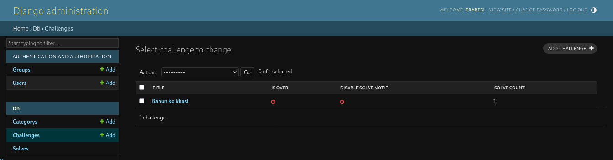
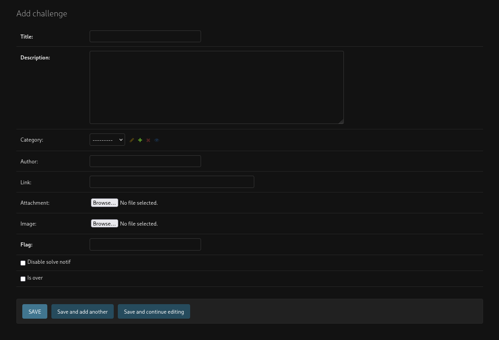
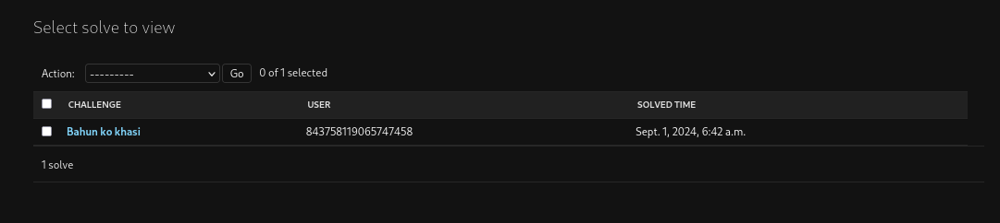
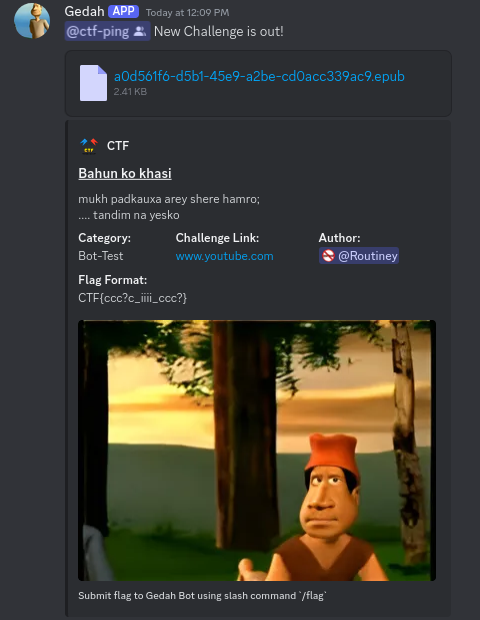
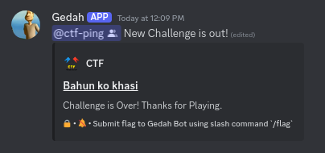
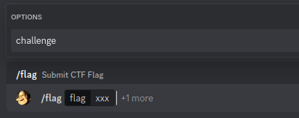
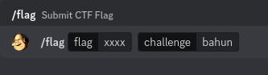
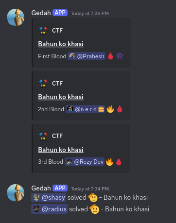

### main branch

This branch includes:
 - Basic yet feature rich CTF Management system to create+edit challenges/submit flags/notify new challenges and bloods/solves.
 - NDV (little-to-No Django View) code. only models and signals. This means no webfront except admin panel
 - single server support only. No-multi tenancy.
 - No scoring system

_The main idea of this project is to get more output with the least effort. This branch will be kept simple. Any extra features and complexities will be on different branches._  

### Test Run
- python bot.py && python ctfdash/manage.py runserver
- Visit: http://127.0.0.1:8000/
- Credentails: admin, flag
- To change, `python manage.py createsuperuser`

### Deploy
- Edit .env.example and ctfdash/.env.example. Rename to .env. Must have same API_KEY on both.
- set nginx.conf
- add ALLOWED_HOSTS in settings.py
- python3 manage.py collectstatic
- chown -R www-data:www-data / chmod -R 755
- `uvicorn ctfdash.asgi:application --host 127.0.0.1 --port 5050`

OR fk it,

- `nohup python3 manage.py runserver 5050 > ~/botlogs/ctf.log 2>&1 &`
- `pkill -ecf "runserver 5050"`

### Screenshots

#### Admin Panel

- Mark challenge as over. Stop solve notifications.

- Full featured

- Solves can't be edited or added

#### Challenge

- Creating new challenge (with is_over=False) sends notification. Attatchment Support

- Updating challenge in django panel updates its discord message as well 

- '🔒' in footer means the challenge is marked as is_over and its flag cannot be submitted.
- '🔕' means the challenge is marked as disable_solve_notif and new solve notification wont be sent for the challenge after submittion currect flag.

#### Flag Submission

- Challenge field is optional. By default, you will be submitting the flag for latest added challenge.

- In challenge field, you are supposed to enter the challenge's name that you have flag for. You don't have to write complete name; just first few initials.

#### Solves

- Seperate custom message format can be set each for first blood, top x blood and remaining solves. Also limit how many solves are to be notified in .env file.

### Tricks

- You can create whole bunch of challenges without publishing them by setting "is_over=True" when creating challenge. It will only go live once you edited the challenge and set it to False.
